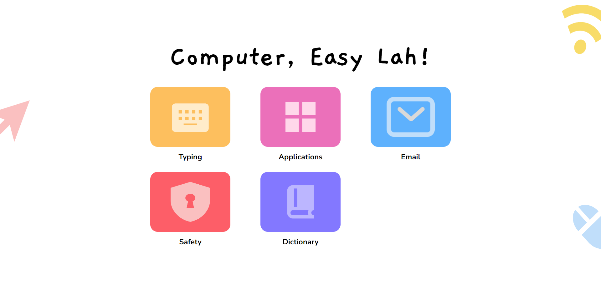

# Bring Learning Beyond Computer Classes

    

## About the Initiative
[Computer, Easy Lah!](https://www.cel.land/home/) is an initiative in collaboration with [Work Live Digital](https://www.linkedin.com/company/worklivedigital?originalSubdomain=sg), a ground up movement that provides free computer classes to senior adults aged 50 and above. 💻🧓

From our personal experience volunteering with Work Live Digital, we identified a gap - after class, there is a lack of a guided and safe environment for the participants to recap and practice what they have learnt.

Thus, we have built [_The Playground_](https://www.cel.land/), a companion for senior adults participating in foundation computer classes. It provides resources and interactive hands-on activities that complement what was taught in class, providing opportunities for learning beyond the classroom context. 🛝

## About The Playground
Our design of _The Playground_ is guided by a simple three-step strategy: **Recap, Practice** and **Test**. This simple strategy allows senior adults to consolidate their learning for both theoretical and practical aspects.

Currently, The Playground offers 4 different topics: Typing, Applications, Email and Safety. The content revolves closely around Work Live Digital's curriculum as our platform is designed to support their classes.

1. Recap

We filmed our own videos that recap the main points taught in each topic.

2. Practice

We created bite-sized interactive activities for hands-on practice, such as typing practices and a guided email walkthrough.

3. Test

We curated simple quizzes for participants to test their knowledge after class.

 

To learn more about how to use _The Playground_ in computer classes for senior adults, do check out our [curriculum](https://www.cel.land/resources/curriculum-guide.pdf) and [playground](https://www.cel.land/resources/playground-guide.pdf) guides. 📖

    

## Interested to Contribute?
_The Playground_ is currently available for free usage in computer classes. That being said, we are constantly refining the content and adding new material that the participants would enjoy.

If you are interested in contributing to our initiative, whether as a developer or as a volunteer for computer classes, feel free to [send us a message](https://www.cel.land/contact), and we will get in touch with you. 😄

## Project Study Partners
We would like to extend our appreciation to the following project study partners supporting our initiative.

    

